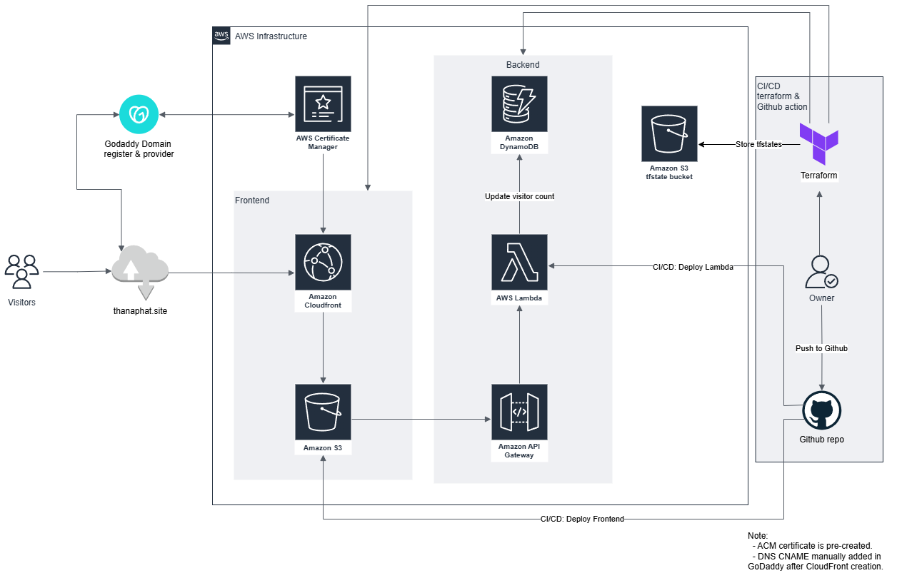

# resume-website-AWS
"This project hosts a personal resume website created for the [Cloud Resume Challenge](https://cloudresumechallenge.dev/docs/the-challenge/aws/) and for hands-on experience with AWS and Terraform. At first, I created this project using the console, and then when I was done, I migrated all resources to be managed Terraform."

## Architecture Overview

---

### Domain Setup

- **Domain Registrar**: GoDaddy
- **DNS**: Configured manually on GoDaddy to point to CloudFront distribution
- **Note**: ACM certificate was pre-created and validated via CNAME record in GoDaddy

---

### Frontend
- **Amazon S3** – Hosts static resume website (HTML/CSS/JS)
- **Amazon CloudFront** – Serves the frontend with HTTPS, using a custom domain
- **AWS Certificate Manager** – SSL certificate for secure HTTPS access
- **GitHub Actions** – CI/CD for frontend deploys

### Backend
- **AWS Lambda** – Serverless functions for backend logic
- **Amazon API Gateway** – Provides REST API interface to Lambda
- **Amazon DynamoDB** – Stores backend visitor data
- **GitHub Actions** – CI/CD pipeline for deploying Lambda functions

### Infrastructure
- **Terraform** – Defines and provisions almost all cloud infrastructure
- **Amazon S3 (tfstate bucket pre-created)** – Stores Terraform state files remotely

---

### Challenges Encountered

- **GoDaddy API Access Denied:**  
  I attempted to automate DNS records via Terraform, but received an *Access Denied* error.  
  This is due to a recent policy change at GoDaddy — API access is now restricted to users with **50+ domains**.  
  [Reference](https://github.com/navilg/godaddy-ddns/issues/32).  
  As a workaround, I manually updated the CNAME record after CloudFront creation.

- **S3 Lifecycle Warning:**  
  When using the `aws_s3_bucket_lifecycle_configuration` resource, Terraform returned a warning.  
  It's a known issue with the AWS provider:  
  [Reference](https://github.com/hashicorp/terraform-provider-aws/issues/41710).
